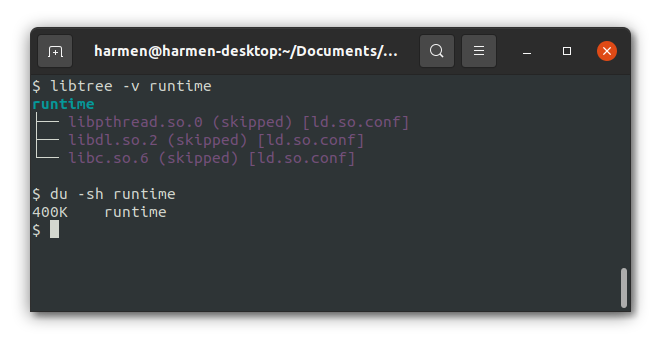

# AppImage runtime without all the appfolder business

Building the dependencies -- note that you might want to mark libfuse as external (`spack external find pkg-config pkgconf libfuse`) so that you can use the system setuid fusermount binary.

```
$ spack -e . install -v
```
If you build libfuse with spack, you'll have to do the system install by hand and make fusermount3 a setuid binary:

```
sudo chown root:root /path/to/fusermount3
sudo chmod u+s /path/to/bin/fusermount3
```

Now build the runtime:

```
$ export C_INCLUDE_PATH=.spack-env/view/include
$ export LIBRARY_PATH=.spack-env/view/lib
$ make
```

Size overhead from the runtime is small:



Now create an AppRun executable in a folder and squashfs it:

```
$ mkdir -p example
$ echo $'#!/usr/bin/bash'$'\n'$'echo "hello world"' > example/AppRun
$ chmod +x example/AppRun
$ mksquashfs example example.squashfs -comp zstd -quiet
```

And merge runtime and the squashfs file into an executable:

```
$ cat runtime example.squashfs > app
$ chmod +x app
$ ./app
hello world
```

Notes about licensing:

- zstd is dual BSD and GPLv2 licensed
- squashfuse is BSD licensed
- libfuse is LGPL licensed
- runtime.c is from AppImageKit and libappimage, which is licensed MIT

I still have to figure out whether or not statically linking to libfuse is a good idea or not in terms of licensing, as well as the implications of dual licensing of zstd.
